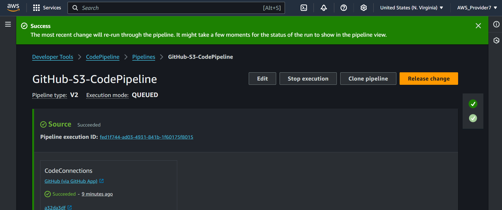
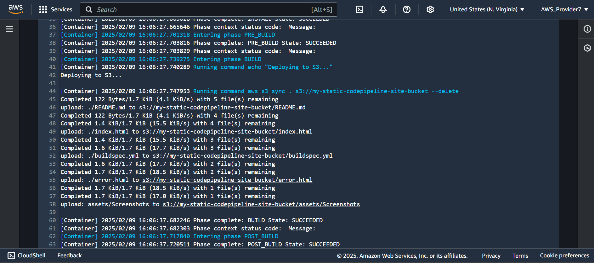
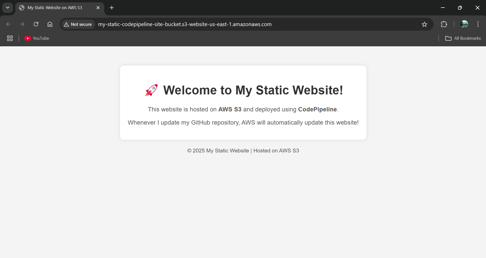
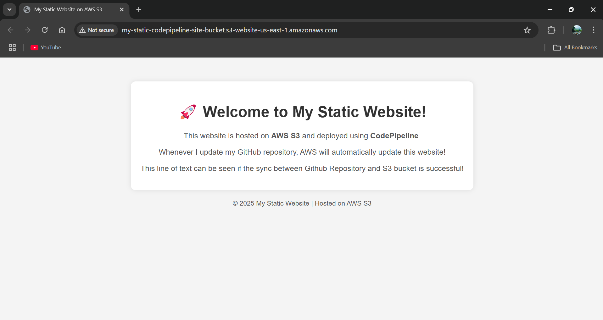
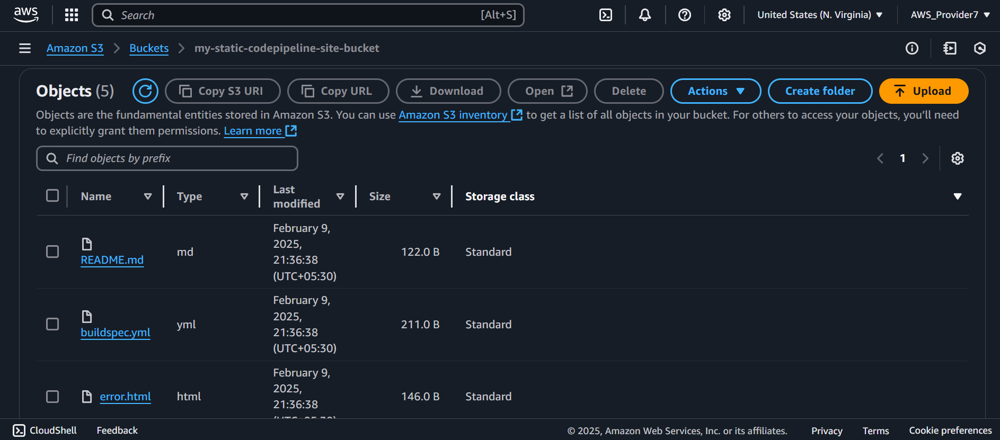
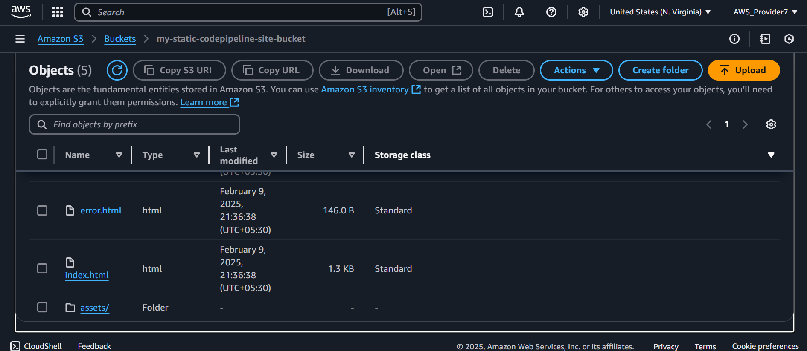

# AWS CodePipeline CI/CD for S3 Static Website Hosting

## 📌 **Project Overview**
This project demonstrates the implementation of a **CI/CD pipeline using AWS CodePipeline and CodeBuild** to automate the deployment of a static website hosted in **Amazon S3**. The pipeline integrates with **GitHub** to ensure that any code changes are automatically deployed to the S3 bucket, making it an excellent example of DevOps automation in cloud environments.

---

## 🚀 **Tech Stack & AWS Services Used**
- **AWS S3** - For static website hosting
- **AWS CodePipeline** - CI/CD pipeline automation
- **AWS CodeBuild** - Building and deploying files to S3
- **GitHub** - Version control and source repository
- **IAM Roles & Policies** - For secure permissions management

---

## 🛠 **Pipeline Workflow**
1️⃣ **Push Code to GitHub** → 2️⃣ **AWS CodePipeline detects the change** → 3️⃣ **AWS CodeBuild syncs updated files to S3** → 4️⃣ **Static Website Updates Automatically**

---

## 📂 **Project Structure**
```
📁 GitHbub-S3-Codepipeline-Project/
 ├── 📄 index.html              # Main webpage file
 ├── 📄 error.html              # Custom error page
 ├── 📄 README.md               # Project documentation
 ├── 📄 buildspec.yml           # Build instructions for AWS CodeBuild
 ├── 📁 assets/                 # Consists of Screenshots of work done 
      ├── 📄 Screenshot_1
      ├── 📄 Screenshot_2
      ├── 📄 Screenshot_3
      ├── 📄 Screenshot_4
      ├── 📄 Screenshot_5
      ├── 📄 Screenshot_6
      ├── 📄 Screenshot_7
      ├── 📄 Screenshot_8
      ├── 📄 Screenshot_9
```

---

## 🏗 **Step-by-Step Implementation**
### **1️⃣ Create & Configure an S3 Bucket**
- **Create an S3 bucket** with a unique name (e.g., `my-static-codepipeline-site-bucket`).
- **Enable Static Website Hosting**.
- **Update Bucket Policy** to allow public read access:

```json
{
    "Version": "2012-10-17",
    "Statement": [
        {
            "Sid": "PublicReadGetObject",
            "Effect": "Allow",
            "Principal": "*",
            "Action": "s3:GetObject",
            "Resource": "arn:aws:s3:::my-static-codepipeline-site-bucket/*"
        }
    ]
}
```

### **2️⃣ Configure GitHub Repository & Permissions**
- **Create a GitHub repository** and push the static website files (`index.html`, `error.html`).
- **Connect AWS CodePipeline to GitHub**.
- **(If needed) Install AWS Connector for GitHub** in repository settings under `GitHub Apps`.

### **3️⃣ Create AWS CodeBuild Project**
- **Operating System:** Amazon Linux 2
- **Runtime:** Standard runtime with Node.js or Python
- **Buildspec File:** Add the following **`buildspec.yml`** to root:

```yaml
version: 0.2
phases:
  install:
    runtime-versions:
      python: 3.x
  build:
    commands:
      - echo "Deploying files to S3"
      - aws s3 sync . s3://my-static-codepipeline-site-bucket --delete
```

### **4️⃣ Create AWS CodePipeline**
- **Source:** GitHub repository
- **Build Stage:** AWS CodeBuild
- **Deploy Stage:** Sync to S3 bucket
- **IAM Role Permissions:** Ensure CodePipeline and CodeBuild have `S3FullAccess` permission. (*or Selective Accesses can also be given for added security*)
---

## 📸 **Screenshots for Proof of Work**
### ✅ 1. **GitHub Repository**

*Showing `index.html`, `error.html`, `buildspec.yml` files.* 

---
### ✅ 2. **AWS CodePipeline Execution**


---


---

*Screenshots of successful CodePipeline deployment.*  

---
### ✅ 3. **AWS CodeBuild Logs**


---

*Verifying successful build and deployment steps.*  

---

### ✅ **4. Checking Proper Working of the Project**


*Initial S3 Static Website before linking and committing changes.*

---


*Initial S3 Bucket objects before building CodePipeline.*

---

*Screenshot showing changes committed in index.html to verify proper functioning of CodePipeline*

---

*Screenshot of the updated S3 static website, proving successful syncing of GitHub Repository and S3 Bucket.*

---



---

*Screenshot of updated S3 Bucket Objects.*


---
## 🔥 **Live Demo**
Copy the link below and paste it in your browser:
```
http://my-static-codepipeline-site-bucket.s3-website-us-east-1.amazonaws.com/
```

---

## 📌 **Troubleshooting & Common Issues**
### **🔴 CodePipeline Execution Fails**
- Check **IAM Role Permissions** for CodePipeline & CodeBuild.
- Ensure GitHub is connected correctly.

### **🔴 AWS CodeBuild "Access Denied" Error**
- Add necessary S3 permissions for the CodeBuild IAM role.
- Check `buildspec.yml` syntax and commands.

### **🔴 CloudFront Shows "Access Denied"**
- Ensure **OAC (Origin Access Control)** is enabled.
- Update **S3 bucket policy** to allow CloudFront access.

---

## 📌 **Future Improvements**
- ✅ Implement **GitHub Actions** as an alternative CI/CD approach.
- ✅ Add **AWS Lambda functions** for serverless automation.
- ✅ Implement **CloudFront HTTPS** for better security & performance.

---

### **🔗 Connect with Me**
- **LinkedIn:** [Your LinkedIn Profile](#)
- **GitHub:** [Your GitHub Profile](#)
- **Portfolio:** [Your Portfolio Website](#)

---

🚀 **If you find this project useful, feel free to ⭐ star the repository!** 🚀

